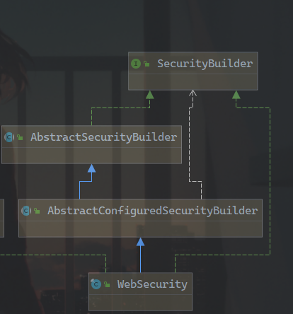

# 从spring boot的逻辑里看spring security如何生效

## 从spring boot角度切入

查看spring boot官方文档里[*创建你自己的自动配置*](https://docs.spring.io/spring-boot/docs/current/reference/htmlsingle/#boot-features-developing-auto-configuration)相关章节。
里面讲解得很清楚，spring提供一种类似java spi的插件机制，你可以在`META-INF/spring.factories`中编写你自己的自动配置类。spring boot要编写一个自动配置类只需要在文件中加入

```properties
org.springframework.boot.autoconfigure.EnableAutoConfiguration=\
com.example.ExampleAutoConfiguration,\
com.example.ExampleAutoConfiguration2
```

这样spring boot就会为止提供所需要的所有自动配置能力，那么什么是我们需要的自动配置能力呢？

试想如果我们想要编写一个自动配置类，那么我需要的是： *在某某特定情况下我的某某配置生效，在某某特定情况下我会生成某个bean*。
这就是必要需求,而spring boot的spring-boot-autoconfigure包就为我们提供了这种能力就为我们提供了这种能力。
例如：`@ConditionalOnClass`在包含某个类时生效，`@ConditionalOnBean`在包含某个bean时生效。另外我们可以继承`SpringBootCondition`类配合使用`@Conditional`进行自定义

具体请查看`org.springframework.boot:spring-boot-autoconfigure`下的`org.springframework.boot.autoconfigure.condition`包，后续遇到也会继续讲解相关注解及作用

当配置了`org.springframework.boot:spring-boot-starter-security`之后，查看pom文件发现没有任何代码，不用惊讶，实际上所有的spring-boot-starter都是整合，那么自动配置在哪里呢？
答案是在`org.springframework.boot:spring-boot-autoconfigure`就已经把所有的spring-boot相关的自动配置类已经全部集中在一起写完了。
而查看`META-INF/spring.factories`发现，与spring-security相关的自动配置类总共有

```
org.springframework.boot.autoconfigure.security.servlet.SecurityAutoConfiguration,\
org.springframework.boot.autoconfigure.security.servlet.SecurityRequestMatcherProviderAutoConfiguration,\
org.springframework.boot.autoconfigure.security.servlet.UserDetailsServiceAutoConfiguration,\
org.springframework.boot.autoconfigure.security.servlet.SecurityFilterAutoConfiguration,\
org.springframework.boot.autoconfigure.security.reactive.ReactiveSecurityAutoConfiguration,\
org.springframework.boot.autoconfigure.security.reactive.ReactiveUserDetailsServiceAutoConfiguration,\
org.springframework.boot.autoconfigure.sendgrid.SendGridAutoConfiguration,\
org.springframework.boot.autoconfigure.session.SessionAutoConfiguration,\
org.springframework.boot.autoconfigure.security.oauth2.client.servlet.OAuth2ClientAutoConfiguration,\
org.springframework.boot.autoconfigure.security.oauth2.client.reactive.ReactiveOAuth2ClientAutoConfiguration,\
org.springframework.boot.autoconfigure.security.oauth2.resource.servlet.OAuth2ResourceServerAutoConfiguration,\
org.springframework.boot.autoconfigure.security.oauth2.resource.reactive.ReactiveOAuth2ResourceServerAutoConfiguration,\
```

这么多？？但是我们实际上主要分析在阻塞io下的普通spring-security代码即可，也就是说实际与我们相关的主要是`org.springframework.boot.autoconfigure.security.servlet.SecurityAutoConfiguration,\
                                                             org.springframework.boot.autoconfigure.security.servlet.SecurityRequestMatcherProviderAutoConfiguration,\
                                                             org.springframework.boot.autoconfigure.security.servlet.UserDetailsServiceAutoConfiguration,\
                                                             org.springframework.boot.autoconfigure.security.servlet.SecurityFilterAutoConfiguration,\`
这四个自动配置类。

*保持清醒*，spring代码的特性出现了，*大·无限发散术*，当我们在分析代码的时候总会碰到这个问题，代码会无限发散，而spring中这种业界标杆的代码中，更是无限放大。
但是还是请保持清醒，把每个层级理清楚，不多看，但是也不漏下。

继续分别查看这四个类，看看具体生效的是哪些东西呢？

### SecurityAutoConfiguration

```java
@Configuration
@ConditionalOnClass(DefaultAuthenticationEventPublisher.class)
@EnableConfigurationProperties(SecurityProperties.class)
@Import({ SpringBootWebSecurityConfiguration.class, WebSecurityEnablerConfiguration.class,
		SecurityDataConfiguration.class })
public class SecurityAutoConfiguration {

	@Bean
	@ConditionalOnMissingBean(AuthenticationEventPublisher.class)
	public DefaultAuthenticationEventPublisher authenticationEventPublisher(
			ApplicationEventPublisher publisher) {
		return new DefaultAuthenticationEventPublisher(publisher);
	}

}
```

排除掉其他注解，主要思想是`@EnableConfigurationProperties(SecurityProperties.class)`可以通过属性配置用户信息等，不重要。然后通过`@Import`又引入了三个类

其中涉及到spring中的自动配置的注解为`@Import`注解，
在`@Import`源码中，能够看到实际上它的作用很简单，只有一句话：**表示要导入的一个或多个{@link Configuration @Configuration}类**，不用再继续追究spring如何实现，通过这个注释能够知道，spring通过`@import`注解能使其他的配置类生效即可。
同时在更详细的注释里还能看到可以**使ImportSelector以及ImportBeanDefinitionRegistrar生效**。

* ImportSelector接口只有一个方法，是`String[] selectImports(AnnotationMetadata importingClassMetadata)`，回调使被导入的相关mata数据，然后用户可通过这些mata数据，动态的返回任何Configuration
* ImportBeanDefinitionRegistrar接口仍然只有一个方法，它用来更灵活的去选择注册bean。

分别引入的三个类为：`SpringBootWebSecurityConfiguration`，`WebSecurityEnablerConfiguration`，`SecurityDataConfiguration`。
继续发散:

查看`SpringBootWebSecurityConfiguration`,核心代码只有一个，返回一个`WebSecurityConfigurerAdapter`的无实现子类,而这个类正是我们在使用时会自行继承的类

```java
@Configuration
@ConditionalOnClass(WebSecurityConfigurerAdapter.class)
@ConditionalOnMissingBean(WebSecurityConfigurerAdapter.class)
@ConditionalOnWebApplication(type = Type.SERVLET)
public class SpringBootWebSecurityConfiguration {

	@Configuration
	@Order(SecurityProperties.BASIC_AUTH_ORDER)
	static class DefaultConfigurerAdapter extends WebSecurityConfigurerAdapter {

	}
}
```

查看`WebSecurityEnablerConfiguration`，核心代码更简单，只是启用了一个`@EnableWebSecurity`注解（所以说，对我们这个菜鸡来说，分这么细，何苦呢

```java
@Configuration
@ConditionalOnBean(WebSecurityConfigurerAdapter.class)
@ConditionalOnMissingBean(name = BeanIds.SPRING_SECURITY_FILTER_CHAIN)
@ConditionalOnWebApplication(type = ConditionalOnWebApplication.Type.SERVLET)
@EnableWebSecurity
public class WebSecurityEnablerConfiguration {

}

```

查看`SecurityDataConfiguration`，代码也很简单，返回一个`SecurityEvaluationContextExtension`，用于spring-data集成，目前与spring-security核心逻辑无关，直接排除。

### SecurityRequestMatcherProviderAutoConfiguration

这也是个很简单的自动配置类，未引入任何多余的东西，只是返回了一个`RequestMatcherProvider`Bean,另外的代码是在结合代码分析很容易看出来是非web下的，直接略过

```java
@Bean
		@ConditionalOnClass(DispatcherServlet.class)
		public RequestMatcherProvider requestMatcherProvider(
				HandlerMappingIntrospector introspector) {
			return new MvcRequestMatcherProvider(introspector);
		}

```

### UserDetailsServiceAutoConfiguration

简单的自动配置类，返回一个`InMemoryUserDetailsManager`Bean，并且注意是在我们未配置`UserDetailsService`的情况下

```java
@Configuration
@ConditionalOnClass(AuthenticationManager.class)
@ConditionalOnBean(ObjectPostProcessor.class)
//注意是在我们未配置`UserDetailsService`的情况下
@ConditionalOnMissingBean({ AuthenticationManager.class, AuthenticationProvider.class,
		UserDetailsService.class })
public class UserDetailsServiceAutoConfiguration {

	private static final String NOOP_PASSWORD_PREFIX = "{noop}";

	private static final Pattern PASSWORD_ALGORITHM_PATTERN = Pattern
			.compile("^\\{.+}.*$");

	private static final Log logger = LogFactory
			.getLog(UserDetailsServiceAutoConfiguration.class);

	@Bean
	@ConditionalOnMissingBean(
			type = "org.springframework.security.oauth2.client.registration.ClientRegistrationRepository")
	@Lazy
	public InMemoryUserDetailsManager inMemoryUserDetailsManager(
			SecurityProperties properties,
			ObjectProvider<PasswordEncoder> passwordEncoder) {
		SecurityProperties.User user = properties.getUser();
		List<String> roles = user.getRoles();
		return new InMemoryUserDetailsManager(User.withUsername(user.getName())
				.password(getOrDeducePassword(user, passwordEncoder.getIfAvailable()))
				.roles(StringUtils.toStringArray(roles)).build());
	}

	private String getOrDeducePassword(SecurityProperties.User user,
			PasswordEncoder encoder) {
		String password = user.getPassword();
		if (user.isPasswordGenerated()) {
			logger.info(String.format("%n%nUsing generated security password: %s%n",
					user.getPassword()));
		}
		if (encoder != null || PASSWORD_ALGORITHM_PATTERN.matcher(password).matches()) {
			return password;
		}
		return NOOP_PASSWORD_PREFIX + password;
	}

}
```


### SecurityFilterAutoConfiguration

在本类中，还是没有引入新的配置类（松了一口大气，呼。

```java
@Configuration
@ConditionalOnWebApplication(type = Type.SERVLET)
@EnableConfigurationProperties(SecurityProperties.class)
@ConditionalOnClass({ AbstractSecurityWebApplicationInitializer.class,
		SessionCreationPolicy.class })
@AutoConfigureAfter(SecurityAutoConfiguration.class)
public class SecurityFilterAutoConfiguration {

	private static final String DEFAULT_FILTER_NAME = AbstractSecurityWebApplicationInitializer.DEFAULT_FILTER_NAME;

	@Bean
	@ConditionalOnBean(name = DEFAULT_FILTER_NAME)
	public DelegatingFilterProxyRegistrationBean securityFilterChainRegistration(
			SecurityProperties securityProperties) {
		DelegatingFilterProxyRegistrationBean registration = new DelegatingFilterProxyRegistrationBean(
				DEFAULT_FILTER_NAME);
		registration.setOrder(securityProperties.getFilter().getOrder());
		registration.setDispatcherTypes(getDispatcherTypes(securityProperties));
		return registration;
	}

	private EnumSet<DispatcherType> getDispatcherTypes(
			SecurityProperties securityProperties) {
		if (securityProperties.getFilter().getDispatcherTypes() == null) {
			return null;
		}
		return securityProperties.getFilter().getDispatcherTypes().stream()
				.map((type) -> DispatcherType.valueOf(type.name())).collect(Collectors
						.collectingAndThen(Collectors.toSet(), EnumSet::copyOf));
	}

}
```

详细讲解一个返回的`DelegatingFilterProxyRegistrationBean`，它继承自`AbstractFilterRegistrationBean`类，
它的作用是可以向Servlet中动态注册一个Filter，它主要是通过`getFilter`这个重写方法让用户选择返回怎样的一个Filter。而在这次的返回中，
DelegatingFilterProxyRegistrationBean继续延迟了filter的加载，它重写的`getFilter`方法中返回了一个`DelegatingFilterProxy`，
并传递了一个`springSecurityFilterChain`的名字,而`DelegatingFilterProxy`中的`initFilterBean`方法又被重写了，还专门加入了不初始化的注释

```java
@Override
	public DelegatingFilterProxy getFilter() {
		return new DelegatingFilterProxy(this.targetBeanName,
				getWebApplicationContext()) {

			@Override
			protected void initFilterBean() throws ServletException {
				// Don't initialize filter bean on init()
			}

		};
	}
```

再查看`DelegatingFilterProxy`类中

```java
@Override
public void doFilter(ServletRequest request, ServletResponse response, FilterChain filterChain)
        throws ServletException, IOException {

    // Lazily initialize the delegate if necessary.
    Filter delegateToUse = this.delegate;
    if (delegateToUse == null) {
        synchronized (this.delegateMonitor) {
            delegateToUse = this.delegate;
            if (delegateToUse == null) {
                WebApplicationContext wac = findWebApplicationContext();
                if (wac == null) {
                    throw new IllegalStateException("No WebApplicationContext found: " +
                            "no ContextLoaderListener or DispatcherServlet registered?");
                }
                delegateToUse = initDelegate(wac);
            }
            this.delegate = delegateToUse;
        }
    }

    // Let the delegate perform the actual doFilter operation.
    invokeDelegate(delegateToUse, request, response, filterChain);
}
protected Filter initDelegate(WebApplicationContext wac) throws ServletException {
    String targetBeanName = getTargetBeanName();
    Assert.state(targetBeanName != null, "No target bean name set");
    Filter delegate = wac.getBean(targetBeanName, Filter.class);
    if (isTargetFilterLifecycle()) {
        delegate.init(getFilterConfig());
    }
    return delegate;
}

```

可以看到DoFilter方法中，还有一层查找具体filter的代码，具体逻辑很简单，在`initDelegate`中可以看到，就是使用context查找bean，也就是说此Filter被延迟到了最终执行时才加载。

至此。spring boot所做的所有准备工作都已经分析完毕。当然了，还留下了一些类具体作用未讲，这主要是因为这些类都属于spring-security了，不再与springboot自动配置相关。

我们把这些坑集中起来，放在后面持续讲解：

* WebSecurityConfigurerAdapter
* UserDetailsService
* 被称为`springSecurityFilterChain`的Filter

spring boot切入点找完后(写这么长才写完spring boot的，是真的心累)，再看看demo例子，或者说我们平时如何使用spring security的呢？

## 从实际编写角度切入

我们查看demo中主要的[WebSecurityConfig](https://github.com/zidoshare/spring-boot-security-demo/blob/master/src/main/java/site/zido/demo/common/WebSecurityConfig.java)类

如何切入spring security的自动配置呢？关键就在于`@EnableWebSecurity`注解，我们查看该注解的源代码：

```java
@Retention(value = java.lang.annotation.RetentionPolicy.RUNTIME)
@Target(value = { java.lang.annotation.ElementType.TYPE })
@Documented
@Import({ WebSecurityConfiguration.class,
		SpringWebMvcImportSelector.class,
		OAuth2ImportSelector.class })
@EnableGlobalAuthentication
@Configuration
public @interface EnableWebSecurity {

	boolean debug() default false;
}
```

同样的，我们在`@EnableGlobalAuthentication`注解源代码中也能看到这个`@Import`注解。

WebSecurityConfiguration类是一个配置类放在后面讲，先查看这两个ImportSelector，看看他们做了什么准备工作：

## 两个ImportSelector

### OAuth2ImportSelector

它是**ImportSelector**的实现类，这是用来配置OAuth2相关的：

```java
final class OAuth2ImportSelector implements ImportSelector {

	@Override
	public String[] selectImports(AnnotationMetadata importingClassMetadata) {
		boolean oauth2ClientPresent = ClassUtils.isPresent(
			"org.springframework.security.oauth2.client.registration.ClientRegistration", getClass().getClassLoader());

		return oauth2ClientPresent ?
			new String[] { "org.springframework.security.config.annotation.web.configuration.OAuth2ClientConfiguration" } :
			new String[] {};
	}
}
```

这是一种典型的通过查询某各类是否存在以用来判断某个模块是否存在而进行相应的自动配置的写法，
比如此处实际上是为了查找是否包含了`spring-security-oauth2-client`模块，如果包含则进行相应的自动配置

### SpringWebMvcImportSelector

在`SpringWebMvcImportSelector`中，也采用了同样的机制：

```java
class SpringWebMvcImportSelector implements ImportSelector {

	/*
	 * (non-Javadoc)
	 *
	 * @see org.springframework.context.annotation.ImportSelector#selectImports(org.
	 * springframework .core.type.AnnotationMetadata)
	 */
	public String[] selectImports(AnnotationMetadata importingClassMetadata) {
		boolean webmvcPresent = ClassUtils.isPresent(
				"org.springframework.web.servlet.DispatcherServlet",
				getClass().getClassLoader());
		return webmvcPresent
				? new String[] {
						"org.springframework.security.config.annotation.web.configuration.WebMvcSecurityConfiguration" }
				: new String[] {};
	}
}
```

查询是否引入了spring mvc,如果引入，则进行webMvc相关自动配置。
**同时应当留意WebMvcSecurityConfiguration类，很明显，一般情况下我们都会引入spring mvc，也因此，这个自动配置类是一个重要的入口**

----------------

以上，最终剥离了两个主要的自动配置类

* WebMvcSecurityConfiguration:由SpringWebMvcImportSelector类通过查找mvc模块而进行的自动配置类
* WebSecurityConfiguration: 由EnableWebSecurity直接引入的自动配置类
  ，以及一个不常用的Oauth客户端配置类，可以暂且不管。


### WebMvcSecurityConfiguration

```java
class WebMvcSecurityConfiguration implements WebMvcConfigurer, ApplicationContextAware {
	private BeanResolver beanResolver;

	@Override
	@SuppressWarnings("deprecation")
	public void addArgumentResolvers(List<HandlerMethodArgumentResolver> argumentResolvers) {
		AuthenticationPrincipalArgumentResolver authenticationPrincipalResolver = new AuthenticationPrincipalArgumentResolver();
		authenticationPrincipalResolver.setBeanResolver(beanResolver);
		argumentResolvers.add(authenticationPrincipalResolver);
		argumentResolvers
				.add(new org.springframework.security.web.bind.support.AuthenticationPrincipalArgumentResolver());

		CurrentSecurityContextArgumentResolver currentSecurityContextArgumentResolver = new CurrentSecurityContextArgumentResolver();
		currentSecurityContextArgumentResolver.setBeanResolver(beanResolver);
		argumentResolvers.add(currentSecurityContextArgumentResolver);
		argumentResolvers.add(new CsrfTokenArgumentResolver());
	}

	@Bean
	public RequestDataValueProcessor requestDataValueProcessor() {
		return new CsrfRequestDataValueProcessor();
	}

	@Override
	public void setApplicationContext(ApplicationContext applicationContext) throws BeansException {
		this.beanResolver = new BeanFactoryResolver(applicationContext.getAutowireCapableBeanFactory());
	}
}

```

`HandlerMethodArgumentResolver`是spring mvc用来处理controller参数的扩展点，而在此类中插入了两个Resolver,其中`org.springframework.security.web.bind.support.AuthenticationPrincipalArgumentResolver`
是用来兼容以前的注解，可以不关注，直接查看`CurrentSecurityContextArgumentResolver`的代码，其中resolveArgument方法，是主要处理方法，很简单的逻辑：

```java
public final class CurrentSecurityContextArgumentResolver
		implements HandlerMethodArgumentResolver {
//...
    public Object resolveArgument(MethodParameter parameter,
    				ModelAndViewContainer mavContainer, NativeWebRequest webRequest,
    				WebDataBinderFactory binderFactory) throws Exception {
    		SecurityContext securityContext = SecurityContextHolder.getContext();
    		if (securityContext == null) {
    			return null;
    		}
    		Object securityContextResult = securityContext;
    
    		CurrentSecurityContext securityContextAnnotation = findMethodAnnotation(
    				CurrentSecurityContext.class, parameter);
    
    		String expressionToParse = securityContextAnnotation.expression();
    		if (StringUtils.hasLength(expressionToParse)) {
    			StandardEvaluationContext context = new StandardEvaluationContext();
    			context.setRootObject(securityContext);
    			context.setVariable("this", securityContext);
    
    			Expression expression = this.parser.parseExpression(expressionToParse);
    			securityContextResult = expression.getValue(context);
    		}
    
    		if (securityContextResult != null
    				&& !parameter.getParameterType().isAssignableFrom(securityContextResult.getClass())) {
    			if (securityContextAnnotation.errorOnInvalidType()) {
    				throw new ClassCastException(securityContextResult + " is not assignable to "
    						+ parameter.getParameterType());
    			}
    			else {
    				return null;
    			}
    		}
    		return securityContextResult;
    	}
		}
//...
```

主要作用是从`SecurityContextHolder`中获取`SecurityContext`并通过`spel`表达式去转化为我们需要的对象。

简单的理解就是可以用来获取我们当前请求所对应的登录用户


### WebSecurityConfiguration

此配置类就复杂多了，里面涉及到很多构造工厂去帮助我们配置spring security中各种庞杂的过滤器。

WebSecurityConfiguration实现了两个接口分别是`ImportAware`和`BeanClassLoaderAware`，分别用于获取导入本类的元数据和Bean的ClassLoader。

通过查看源码中生成的Bean，我们可以大概观察到最终是为了生成一个`Filter`，具体是指`FilterChainProxy`类，这也是Spring Security真正起作用的类了。它是web servlet中的标准过滤器。
而通过名称也能够知道，它实际上只是一个代理，实际上它的属性`List<SecurityFilterChain>`才是最终实际的过滤链。
常常被用来鉴权。

```java
@Bean(name = AbstractSecurityWebApplicationInitializer.DEFAULT_FILTER_NAME)
public Filter springSecurityFilterChain() throws Exception {
    boolean hasConfigurers = webSecurityConfigurers != null
            && !webSecurityConfigurers.isEmpty();
    if (!hasConfigurers) {
        WebSecurityConfigurerAdapter adapter = objectObjectPostProcessor
                .postProcess(new WebSecurityConfigurerAdapter() {
                });
        webSecurity.apply(adapter);
    }
    return webSecurity.build();
}
```

可以查看首先是`webSecurityConfigurers`属性，这个属性通过以下方法注入：

```java
@Autowired(required = false)
public void setFilterChainProxySecurityConfigurer(
        ObjectPostProcessor<Object> objectPostProcessor,
        @Value("#{@autowiredWebSecurityConfigurersIgnoreParents.getWebSecurityConfigurers()}") List<SecurityConfigurer<Filter, WebSecurity>> webSecurityConfigurers)
        throws Exception {
    webSecurity = objectPostProcessor
            .postProcess(new WebSecurity(objectPostProcessor));
    if (debugEnabled != null) {
        webSecurity.debug(debugEnabled);
    }

    Collections.sort(webSecurityConfigurers, AnnotationAwareOrderComparator.INSTANCE);

    Integer previousOrder = null;
    Object previousConfig = null;
    for (SecurityConfigurer<Filter, WebSecurity> config : webSecurityConfigurers) {
        Integer order = AnnotationAwareOrderComparator.lookupOrder(config);
        if (previousOrder != null && previousOrder.equals(order)) {
            throw new IllegalStateException(
                    "@Order on WebSecurityConfigurers must be unique. Order of "
                            + order + " was already used on " + previousConfig + ", so it cannot be used on "
                            + config + " too.");
        }
        previousOrder = order;
        previousConfig = config;
    }
    for (SecurityConfigurer<Filter, WebSecurity> webSecurityConfigurer : webSecurityConfigurers) {
        webSecurity.apply(webSecurityConfigurer);
    }
    this.webSecurityConfigurers = webSecurityConfigurers;
}

```

可以看到这个方法的作用是扫描`SecurityConfigurer<Filter, WebSecurity>`Bean，然后排序之后，分别让这些类对于`WebSecurity`这个`SeucirtyFilterChain`的Builder起配置作用。

本类中总共引出下列三个核心的类：

* SecurityFilterChain: spring security的核心过滤器
* WebSecurity: 过滤器的构造器，最终构造结果就是SecurityFilterChain类
* SecurityConfigurer： 过滤器的配置类，可以通过注入Bean，来实现应用

### SecurityFilterChain

通过查看SecurityFilterChain的实现类发现它只有一个默认的实现类，为`DefaultSecurityFilterChain`:

```java
public final class DefaultSecurityFilterChain implements SecurityFilterChain {
	private static final Log logger = LogFactory.getLog(DefaultSecurityFilterChain.class);
	private final RequestMatcher requestMatcher;
	private final List<Filter> filters;

	public DefaultSecurityFilterChain(RequestMatcher requestMatcher, Filter... filters) {
		this(requestMatcher, Arrays.asList(filters));
	}

	public DefaultSecurityFilterChain(RequestMatcher requestMatcher, List<Filter> filters) {
		logger.info("Creating filter chain: " + requestMatcher + ", " + filters);
		this.requestMatcher = requestMatcher;
		this.filters = new ArrayList<>(filters);
	}

	public RequestMatcher getRequestMatcher() {
		return requestMatcher;
	}

	public List<Filter> getFilters() {
		return filters;
	}

	public boolean matches(HttpServletRequest request) {
		return requestMatcher.matches(request);
	}

	@Override
	public String toString() {
		return "[ " + requestMatcher + ", " + filters + "]";
	}
}

```

本类的内容很简单，再次应用了跟Filter一样的责任链设计模式，只是要注意有一个RequestMatcher，也就是说，完全有可能我们通过提供的构造器之类的制作多个FilterChain，来实现组合实现不同接口有完全不同的鉴权登录行为，这一点后面讲。

### WebSecurity

查看本类的源代码会发现继承了很复杂的泛型类和接口，但是不用慌，我们可以慢慢来看：

```java
public final class WebSecurity extends
		AbstractConfiguredSecurityBuilder<Filter, WebSecurity> implements
		SecurityBuilder<Filter>, ApplicationContextAware{
//...
}
```

这里最重要的基类是AbstractConfiguredSecurityBuilder，一路翻看它的继承图


查看最顶层的SecurityBuilder接口，只是最简单的建造者模式接口，作用是构建一个对象：

```java
public interface SecurityBuilder<O> {

	/**
	 * Builds the object and returns it or null.
	 *
	 * @return the Object to be built or null if the implementation allows it.
	 * @throws Exception if an error occurred when building the Object
	 */
	O build() throws Exception;
}
```

接下来的`AbstarctSecurityBuilder`增加实现了基本的构造器，代码也很简单易懂：

```java
public abstract class AbstractSecurityBuilder<O> implements SecurityBuilder<O> {
	private AtomicBoolean building = new AtomicBoolean();

	private O object;

	/*
	 * (non-Javadoc)
	 *
	 * @see org.springframework.security.config.annotation.SecurityBuilder#build()
	 */
	public final O build() throws Exception {
		if (this.building.compareAndSet(false, true)) {
			this.object = doBuild();
			return this.object;
		}
		throw new AlreadyBuiltException("This object has already been built");
	}

	/**
	 * Gets the object that was built. If it has not been built yet an Exception is
	 * thrown.
	 *
	 * @return the Object that was built
	 */
	public final O getObject() {
		if (!this.building.get()) {
			throw new IllegalStateException("This object has not been built");
		}
		return this.object;
	}

	/**
	 * Subclasses should implement this to perform the build.
	 *
	 * @return the object that should be returned by {@link #build()}.
	 *
	 * @throws Exception if an error occurs
	 */
	protected abstract O doBuild() throws Exception;
}
```

但是仍然将`doBuild()`方法抽象出来，主要用于详细的构建过程，然后是`AbstractConfiguredSecurityBuilder`,它的代码非常长，就不单独列出来，可以看到其中增加了一系列的生命周期，并且为它增加了`SecurityConfigurer`的支持：

```java
private <C extends SecurityConfigurer<O, B>> void add(C configurer) throws Exception {
    Assert.notNull(configurer, "configurer cannot be null");

    Class<? extends SecurityConfigurer<O, B>> clazz = (Class<? extends SecurityConfigurer<O, B>>) configurer
            .getClass();
    synchronized (configurers) {
        if (buildState.isConfigured()) {
            throw new IllegalStateException("Cannot apply " + configurer
                    + " to already built object");
        }
        List<SecurityConfigurer<O, B>> configs = allowConfigurersOfSameType ? this.configurers
                .get(clazz) : null;
        if (configs == null) {
            configs = new ArrayList<SecurityConfigurer<O, B>>(1);
        }
        configs.add(configurer);
        this.configurers.put(clazz, configs);
        if (buildState.isInitializing()) {
            this.configurersAddedInInitializing.add(configurer);
        }
    }
}
```

本类将构建过程分成了几个阶段，使用枚举类型`BuildState`进行标记分别有以下阶段，中间穿插实际调用函数：

1. UNBUILT(0) //最开始的状态
2. INITIALIZING(1) //初始化状态
3. beforeInit(); //初始化前执行的方法
4. init(); //执行初始化
5. CONFIGURING(2) //配置状态
6. beforeConfigure(); //配置前执行
7. configure(); //执行配置
8. BUILDING(3) //构建状态
9. O result = performBuild(); //构建的最终结果
10. BUILT(4) //构建完成状态

其中几个before方法都是空实现，子类可以通过此方法编写一些生命周期方法。

init:

```java
private void init() throws Exception {
    Collection<SecurityConfigurer<O, B>> configurers = getConfigurers();

    for (SecurityConfigurer<O, B> configurer : configurers) {
        configurer.init((B) this);
    }

    for (SecurityConfigurer<O, B> configurer : configurersAddedInInitializing) {
        configurer.init((B) this);
    }
}
```

调用configurers的init方法，用于做一些配置的初始化设置。

configure:

```java
private void configure() throws Exception {
    Collection<SecurityConfigurer<O, B>> configurers = getConfigurers();

    for (SecurityConfigurer<O, B> configurer : configurers) {
        configurer.configure((B) this);
    }
}
```

调用configurers的configure方法，执行具体配置，将具体配置全部放到configure类中，实现责任的分离。

performBuild方法继续抽象，由子类实现最终构建

```java
protected abstract O performBuild() throws Exception;
```

最终到达WebSecurity中，通过以上分析，实际我们知道WebSecurity类中的主要关注方法是`performBuild`:

```java
@Override
protected Filter performBuild() throws Exception {
    Assert.state(
            !securityFilterChainBuilders.isEmpty(),
            () -> "At least one SecurityBuilder<? extends SecurityFilterChain> needs to be specified. "
                    + "Typically this done by adding a @Configuration that extends WebSecurityConfigurerAdapter. "
                    + "More advanced users can invoke "
                    + WebSecurity.class.getSimpleName()
                    + ".addSecurityFilterChainBuilder directly");
    int chainSize = ignoredRequests.size() + securityFilterChainBuilders.size();
    List<SecurityFilterChain> securityFilterChains = new ArrayList<>(
            chainSize);
    for (RequestMatcher ignoredRequest : ignoredRequests) {
        securityFilterChains.add(new DefaultSecurityFilterChain(ignoredRequest));
    }
    for (SecurityBuilder<? extends SecurityFilterChain> securityFilterChainBuilder : securityFilterChainBuilders) {
        securityFilterChains.add(securityFilterChainBuilder.build());
    }
    FilterChainProxy filterChainProxy = new FilterChainProxy(securityFilterChains);
    if (httpFirewall != null) {
        filterChainProxy.setFirewall(httpFirewall);
    }
    filterChainProxy.afterPropertiesSet();

    Filter result = filterChainProxy;
    if (debugEnabled) {
        logger.warn("\n\n"
                + "********************************************************************\n"
                + "**********        Security debugging is enabled.       *************\n"
                + "**********    This may include sensitive information.  *************\n"
                + "**********      Do not use in a production system!     *************\n"
                + "********************************************************************\n\n");
        result = new DebugFilter(filterChainProxy);
    }
    postBuildAction.run();
    return result;
}
```

可以看到最终对象是`FilterChainProxy`，但是它又引用了一系列的`SecurityBuilder`用于构建SecurityFilterChain。

但是这一系列的`SecurityBuilder`又是哪来的呢？通过查找，会发现，它的注入是由`WebSecurityConfigurerAdapter`注入的：

```java
public void init(final WebSecurity web) throws Exception {
    final HttpSecurity http = getHttp();
    //注意这里
    web.addSecurityFilterChainBuilder(http).postBuildAction(new Runnable() {
        public void run() {
            FilterSecurityInterceptor securityInterceptor = http
                    .getSharedObject(FilterSecurityInterceptor.class);
            web.securityInterceptor(securityInterceptor);
        }
    });
}
```

而我们通过之前的代码会发现，`WebSecurityConfigurerAdapter`本身会由spring boot默认注入或者我们可以自行注入继承替代，这是spring security的核心入口。

所有的前置配置我们就都能联系起来了。下篇文章我们再来细看spring-security内部的复杂配置逻辑
